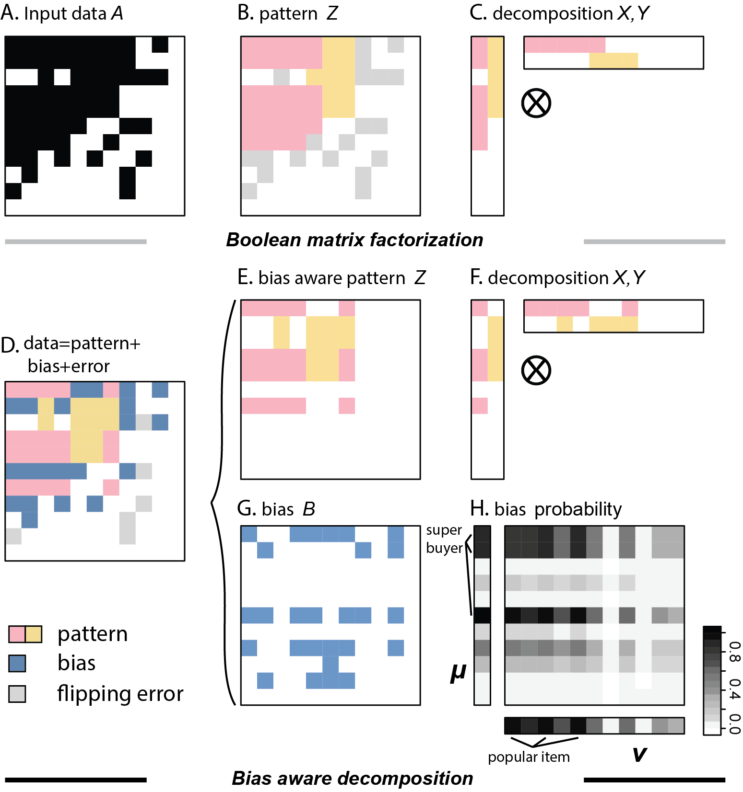

# BABF: Bias Aware Probabilistic Boolean Matrix Facortization

This repository is the code for the UAI 2022 paper, **Bias Aware Probablistic Boolean Matrix Factorization**, which is the first method to derive the Boolean matrix factorization given column- and row-wise bias. Mainly, the difference between Boolean matrix factorization and bias aware boolean matrix factorization could be seen in the following figure.

## Running the code

There are two files in this repository. Bias_BIND.py is the main code for BABF methods. run.py is the example code to run BABF. For convenience, run.py also contains methods to simulate binary matrix with added bias and noise. 

